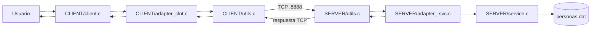
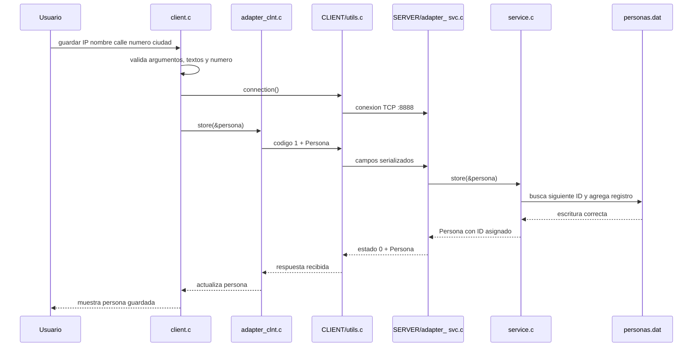
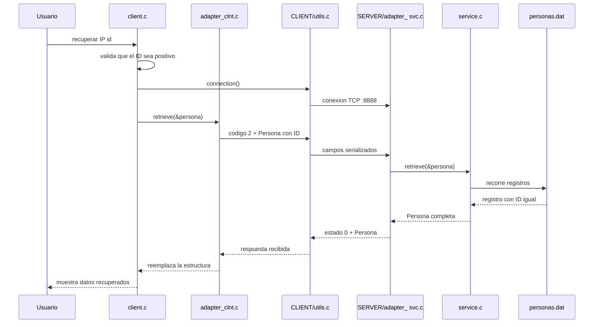

# Actividad 3: cliente RPC para personas

Este proyecto separa un programa en dos procesos: un cliente que recibe una
orden del usuario y un servidor que guarda o recupera personas. La comunicación
se realiza mediante TCP en el puerto `8888`. La idea principal es que el
cliente pueda llamar a `store` o `retrieve` como si fueran funciones locales,
aunque su trabajo se ejecute en el servidor.

Una `Persona` contiene un `id`, un `nombre` y una `Direccion`. La dirección
contiene `calle`, `numero` y `ciudad`. `store(Persona *)` asigna el ID en el
servidor y devuelve la persona modificada al cliente (copy-restore). La
operación `retrieve(Persona *)` recibe un ID y devuelve el registro encontrado.
No existe una operación para modificar posteriormente la ciudad u otro campo.

## Organización del proyecto

La separación de archivos evita mezclar responsabilidades distintas:

| Archivo | Responsabilidad |
| --- | --- |
| `CLIENT/client.c` | Interfaz de línea de comandos, validación de argumentos y decisión entre guardar y recuperar. |
| `CLIENT/client.h` | Tipos `Persona` y `Direccion`, constantes, tipos de socket y declaraciones compartidas por el cliente. |
| `CLIENT/adapter_clnt.c` | Adaptador RPC del cliente. Convierte `store` y `retrieve` en mensajes con códigos de operación. |
| `CLIENT/utils.c` | Conexión TCP del cliente, envío y recepción completa de bytes, conversión de enteros y serialización de personas. |
| `CLIENT/README` | Comandos específicos para compilar y ejecutar el cliente. |
| `SERVER/adapter_svc.c` | Programa servidor: acepta clientes, recibe operaciones, llama al servicio local y devuelve respuestas. El nombre contiene un espacio. |
| `SERVER/server.h` | Tipos, constantes y declaraciones compartidas por el servidor. |
| `SERVER/service.c` | Persistencia en `personas.dat`: asignación de IDs, guardado y búsqueda por ID. |
| `SERVER/utils.c` | Inicialización del servidor, aceptación de conexiones, cierre de sockets y protocolo de bytes. |
| `SERVER/README` | Comandos específicos para compilar y ejecutar el servidor. |
| `SERVER/mensajes.txt` | Archivo heredado de una práctica anterior; no participa en el almacenamiento actual. |
| `SERVER/server` | Binario compilado del servidor, si ya fue generado. No es código fuente. |
| `centralizada.c` | Versión local de demostración, sin comunicación por red. Incluye `service.c` y prueba guardar/recuperar en el mismo proceso. |
| `README_Actividad3.md` | Explicación general, flujo de mensajes, validaciones y referencias de ejecución. |

Los encabezados (`client.h` y `server.h`) mantienen la misma descripción de
`Persona` y del protocolo en ambos lados. `CLIENT/utils.c` y `SERVER/utils.c`
comparten la lógica del formato de red, pero cada uno contiene las funciones
que necesita su lado: el cliente se conecta y el servidor escucha y acepta.

## Flujo general



El recorrido de un mensaje es el siguiente:

1. `client.c` interpreta `argv`. El usuario indica una IP y una operación:
	 `guardar` necesita nombre, calle, número y ciudad; `recuperar` necesita un
	 ID.
2. Antes de abrir la conexión, `client.c` compara la operación y la cantidad
	 de argumentos. También comprueba que las cadenas no alcancen los límites de
	 `NOMBRE_MAX`, `CALLE_MAX` y `CIUDAD_MAX`.
3. Los números pasan por `numero_positivo`. Esta función usa `strtol` para
	 convertir texto decimal y comprueba que no esté vacío, que no queden
	 caracteres sin convertir, que sea mayor que cero y que quepa en un entero de
	 32 bits.
4. `client.c` llama a `connection` de `CLIENT/utils.c`, que crea un socket TCP,
	 convierte el puerto `8888` y conecta con la IP indicada.
5. Para guardar se llama a `store`; para recuperar se llama a `retrieve`. Ambas
	 funciones están en `CLIENT/adapter_clnt.c` y delegan en `llamar`.
6. `llamar` envía primero el código de operación: `1` para guardar o `2` para
	 recuperar. Después envía la persona completa y espera un estado y una
	 persona de respuesta.
7. `CLIENT/utils.c` no transmite la estructura de C como un bloque opaco. Envía
	 sus campos en un orden fijo: `id`, `nombre`, `calle`, `numero` y `ciudad`.
	 Los enteros se convierten con `htonl` al orden de bytes de red.
8. En el servidor, `SERVER/utils.c` acepta la conexión y recibe los bytes con
	 las funciones equivalentes. `SERVER/adapter_svc.c` lee el código, recibe la
	 persona y decide qué función local ejecutar.
9. Para la operación `1`, el adaptador llama a `store` de `service.c`. Para la
	 operación `2`, llama a `retrieve`. Si el código no es `1` ni `2`, produce un
	 error.
10. `service.c` trabaja con `personas.dat`. Al guardar, recorre los registros
		para calcular el siguiente ID disponible, asigna ese ID y agrega la
		estructura al archivo. Al recuperar, busca un registro cuyo ID coincida.
11. El adaptador del servidor envía un estado (`0` significa éxito) y la
		persona resultante. En un guardado, la respuesta contiene el ID asignado;
		en una recuperación, contiene todos los datos encontrados.
12. `adapter_clnt.c` copia la respuesta sobre la estructura original. `client.c`
		cierra el socket, revisa el resultado y muestra la persona final.

## Mensaje de guardado



El ID no lo inventa el cliente. El cliente envía una persona con sus datos y
el servidor determina el siguiente ID leyendo los registros existentes. Por
eso la respuesta es necesaria: permite que el ID asignado en el servidor vuelva
al cliente.

## Mensaje de recuperación



En esta operación solo es relevante el `id` enviado inicialmente. Si
`service.c` no encuentra un registro con ese ID, devuelve error y el servidor
envía un estado distinto de cero.

## Comprobaciones de calidad y consistencia

El programa realiza comparaciones en varias capas. Esto evita aceptar
información incompleta o interpretar de forma diferente un mensaje entre
cliente y servidor.

### Validaciones del cliente

- Compara `argc` y el texto de `argv[2]` para distinguir `guardar` de
	`recuperar` y rechazar combinaciones incorrectas.
- Compara las longitudes de nombre, calle y ciudad con sus constantes máximas
	antes de copiarlas a los arreglos.
- `numero_positivo` compara el texto convertido con cero y con
	`2147483647`, además de comprobar `*texto` y `*fin`. Así rechaza cadenas
	vacías, números negativos, cero, caracteres sobrantes y valores demasiado
	grandes.
- `strcpy` se ejecuta únicamente después de comprobar que cada texto cabe en
	su campo.

### Validaciones durante el transporte

- `enviar_todo` y `recibir_todo` repiten `send` y `recv` hasta completar el
	número de bytes esperado; no asumen que una llamada TCP transmite todo de una
	vez.
- Los enteros pasan por `htonl` y `ntohl`, por lo que ambos extremos usan el
	orden de bytes de red.
- `recibir_persona` limpia la estructura y verifica con `memchr` que nombre,
	calle y ciudad contengan un terminador nulo dentro de sus campos. Esto evita
	tratar datos sin terminador como cadenas C válidas.
- El servidor compara el código de operación con `1` y `2`. Cualquier otro
	valor se marca como error.
- Cada etapa comprueba el valor devuelto por las funciones de red. Si una
	recepción, envío o conexión falla, la llamada termina con error y se cierra
	el socket correspondiente.

### Validaciones del servidor y del almacenamiento

- `store` verifica si puede abrir, leer, escribir y cerrar `personas.dat`.
- Al calcular el siguiente ID, compara los IDs existentes para no reutilizar un
	número mayor o igual al siguiente candidato. También evita incrementar más
	allá de `INT32_MAX`.
- `retrieve` compara el ID solicitado con el ID de cada registro y solo copia
	una persona cuando encuentra coincidencia exacta.
- El estado enviado por el servidor permite al cliente distinguir una respuesta
	exitosa de un error remoto o de un registro inexistente.

Estas comprobaciones no sustituyen una validación de autenticación o permisos;
el ejercicio no implementa usuarios, contraseñas ni cifrado. Su objetivo es
mantener la integridad básica del formato, del flujo de mensajes y del archivo
local.

## Compilación y ejecución

Las instrucciones específicas se conservan en los README de cada módulo:

- [CLIENT/README](CLIENT/README): compilación y ejecución del cliente.
- [SERVER/README](SERVER/README): compilación y ejecución del servidor.

En Linux o macOS, el servidor debe iniciarse antes que el cliente. Desde
`SERVER`, el archivo fuente del adaptador tiene actualmente un espacio en su
nombre, por lo que el comando debe citarlo:

```sh
cd SERVER
cc service.c 'adapter_ svc.c' utils.c -o server
./server
```

En otra terminal, desde `CLIENT`:

```sh
cd CLIENT
cc client.c adapter_clnt.c utils.c -o client
./client 127.0.0.1 guardar "Diego Flores" "Reforma" 123 "Puebla"
./client 127.0.0.1 recuperar 1
```

Para dos computadoras, se sustituye `127.0.0.1` por la IPv4 del equipo donde
se ejecuta el servidor. En Windows deben seguirse los comandos de MinGW-w64
indicados en [CLIENT/README](CLIENT/README) y [SERVER/README](SERVER/README).

## Versión centralizada

`centralizada.c` permite probar la persistencia sin sockets ni dos procesos. El
archivo incluye `SERVER/service.c`, crea una persona local, llama a `store`,
recupera el ID mediante `retrieve` y muestra el resultado. Desde la raíz se
compila y ejecuta así:

```sh
cc centralizada.c -o centralizada
./centralizada demo
```

Esta versión sirve para separar dos posibles problemas: si falla aquí, el
problema está en la lógica de almacenamiento; si funciona aquí pero falla el
cliente remoto, hay que revisar la conexión, el protocolo o el adaptador.

## Archivos de datos y notas

`personas.dat` se crea en el directorio actual del servidor y contiene
estructuras nativas del equipo que las escribió. No debe copiarse como formato
intercambiable entre arquitecturas distintas. La red, en cambio, envía los
campos por separado y los enteros en orden de bytes de red.

`SERVER/mensajes.txt` pertenece a una práctica anterior y no es utilizado por
este programa. Si el proyecto original incluye un `README.pdf`, debe
conservarse como material externo; no forma parte del protocolo ejecutable
descrito aquí.
